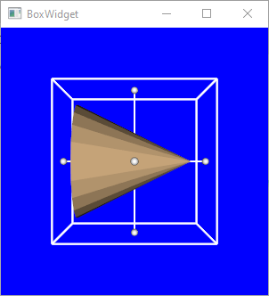

<h1> <b>Learn Julia </b></h1>

- [Basic](#basic)
  - [Project specific Julia environment](#project-specific-julia-environment)
    - [Windows](#windows)
- [VTK](#vtk)
  - [Conda environment set up](#conda-environment-set-up)
  - [First example with callback](#first-example-with-callback)
- [Backup](#backup)

# Basic
## Project specific Julia environment
The motivation to have a project specific Julia environment is to have project specific `Conda.jl` and `PyCall.jl`.

### Windows
```sh
set JULIA_DEPOT_PATH=path\to\your\project\.julia
cd path\to\your\project
julia --project=@.
```
```julia
julia> ]
(project) pkg> instantiate
```
Note that `JULIA_DEPOT_PATH` needs to be set each time in a new terminal and the `.julia` directory could be several GB in size.

Create an `activate.bat` in the project directory to simplify the process.
Use system default Julia environment
```sh
@echo off
set JULIA_DEPOT_PATH=%USERPROFILE%\.julia
echo Set Julia Environment to %JULIA_DEPOT_PATH%
```
Use project specific Julia environment
```sh
@echo off
set JULIA_DEPOT_PATH=%CD%\.julia
echo Set Julia Environment to %JULIA_DEPOT_PATH%
```


# VTK
This section deminstrates the use `VTK`'s `Python` wrapper through `PyCall.jl` and `Conda.jl`.
In the documenation of both `Conda.jl` and `PyCall.jl` states one can only use the `base` env
in `Conda` in `Julia`.  This restriction could be lifted with a change in the `PATH`
environment as shown below.

## Conda environment set up
Download and install `mambaforge` from https://github.com/conda-forge/miniforge.
Tried `miniforge3` and it runs slow on my machine.


Choose a Python version that supports the VTK version desired.
```sh
conda create --name=py38 python=3.8
conda activate py38
conda install vtk
# or install paraview which comes with vtk
# conda install paraview
```
Alternatively, 

In Julia install Conda and PyCall and re-build them to point to the external
Conda above.
```julia
import Pkg
ENV["CONDA_JL_HOME"] = joinpath(ENV["USERPROFILE"], "local", "mambaforge")
Pkg.build("Conda")
```

Exit and enter Julia to make sure Conda is pointing to the external copy.
```julia
using Conda
ENV["PYTHON"] = joinpath(Conda.ROOTENV, "envs", "py38", "python.exe")
Pkg.build("PyCall")
```

Exit and enter Julia.

An error occur when try to import VTK as following.
```julia
using PyCall
vtk = pyimport("vtk")

ERROR: LoadError: PyError (PyImport_ImportModule
.
.
.
) <class 'ModuleNotFoundError'>
ModuleNotFoundError("No module named '_vtkmodules_static'")
  File "C:\Users\Yi-Kun.Yang\local\mambaforge\envs\py38\lib\site-packages\vtk.py", line 30, in <module>
    all_m = importlib.import_module('vtkmodules.all')
  File "C:\Users\Yi-Kun.Yang\local\mambaforge\envs\py38\lib\importlib\__init__.py", line 127, in import_module
    return _bootstrap._gcd_import(name[level:], package, level)
  File "C:\Users\Yi-Kun.Yang\local\mambaforge\envs\py38\lib\site-packages\vtkmodules\__init__.py", line 15, in <module>
    import _vtkmodules_static

Stacktrace:
 [1] pyimport(name::String)
   @ PyCall C:\Users\Yi-Kun.Yang\.julia\packages\PyCall\BD546\src\PyCall.jl:550
.
.
.
```

This could be related to this issue https://github.com/JuliaPy/PyCall.jl/issues/730.

The following code fixes the problem.
Notice this is only tested on the Windows
```julia
path = Conda.bin_dir(dirname(PyCall.pyprogramname))
ENV["PATH"] = path * ";" * ENV["PATH"]
```

This is the snippet used in `learn_PyVtk.jl` to resolve the vtk not loading error.
```julia
using Conda
using PyCall
begin
    # Keyword: VTK, Julia, import _vtkmodules_static, vtkmodules.all
    #
    # Add "...\envs\py38\Library\bin" to path
    # VTK, numpy etc won't work without this
    path = Conda.bin_dir(dirname(PyCall.pyprogramname))
    if isnothing(findfirst(path, ENV["PATH"])) && Sys.iswindows()
        ENV["PATH"] = path * ";" * ENV["PATH"]
    end
end
const vtk = pyimport("vtk")
```
## First example with callback
See `learn_box()` in `learn_PyVtk.jl`.  The callback is a Julia function and
`PyCall` and `VTK`'s python interface handle this beautifully.




# Backup
Plots may conflict with other packages
May need to add/remove Plots, solved by
]
rm Plots
resolve

now it is fine
checkout the original Project.toml
resolve